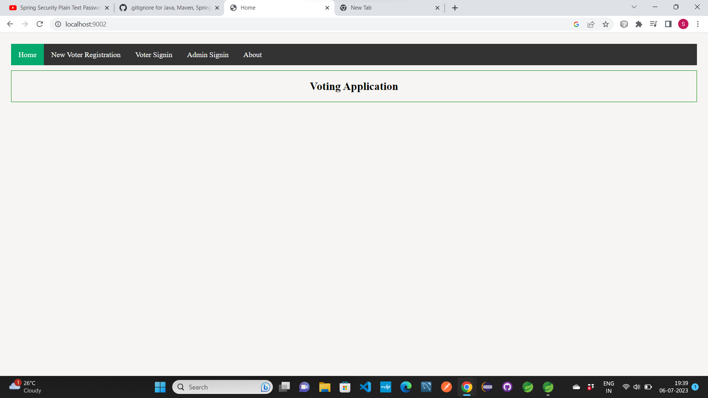
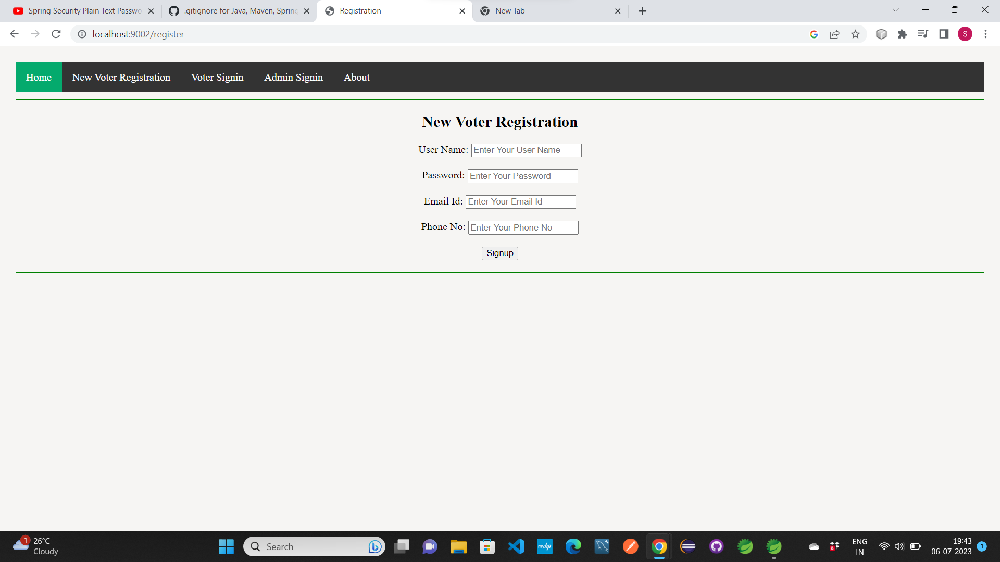
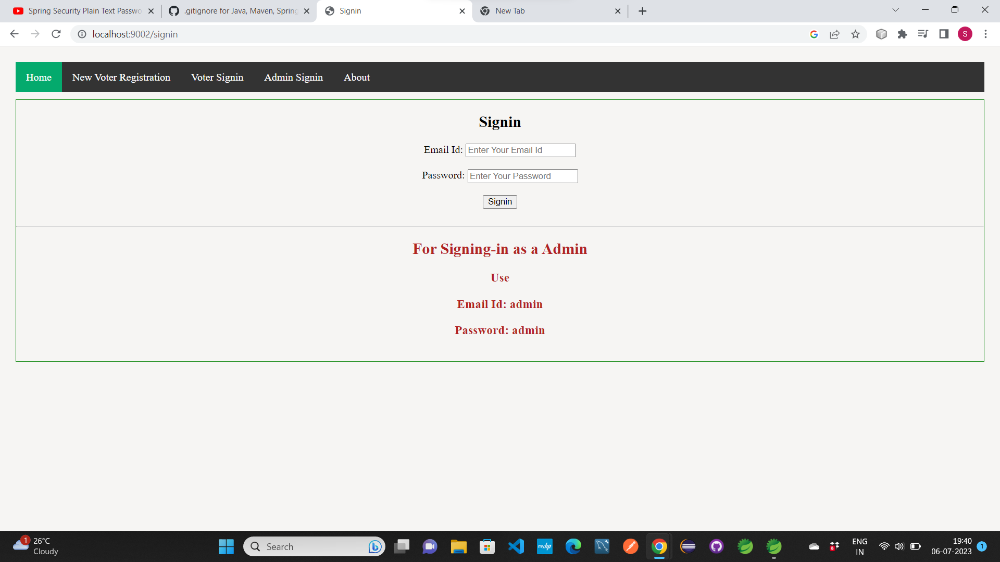
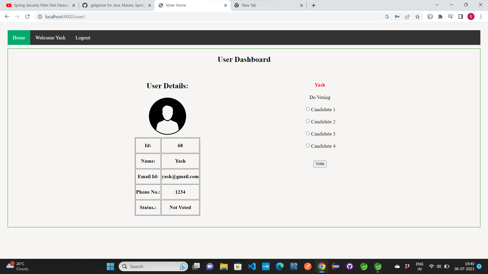
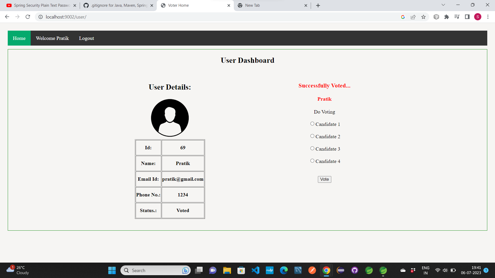
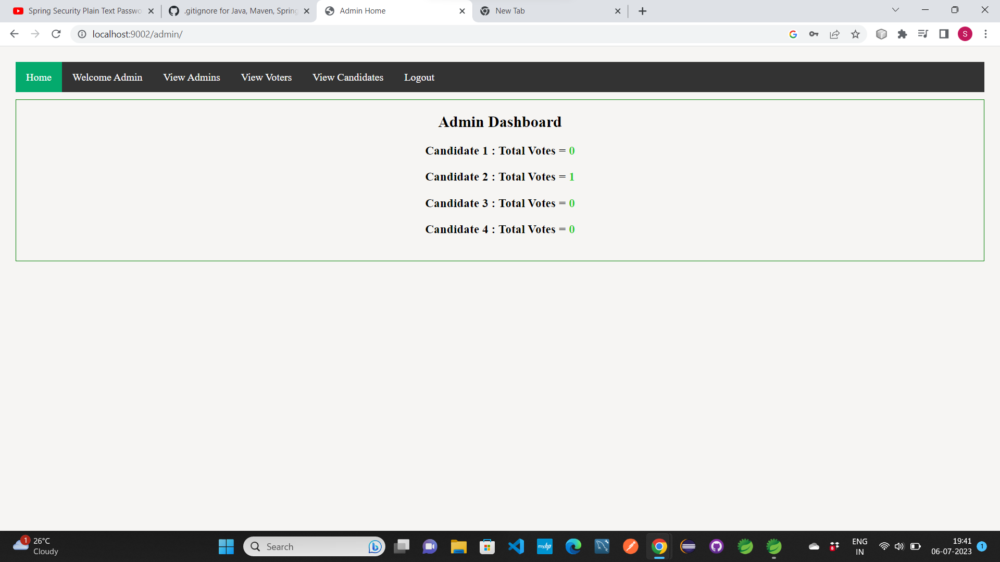
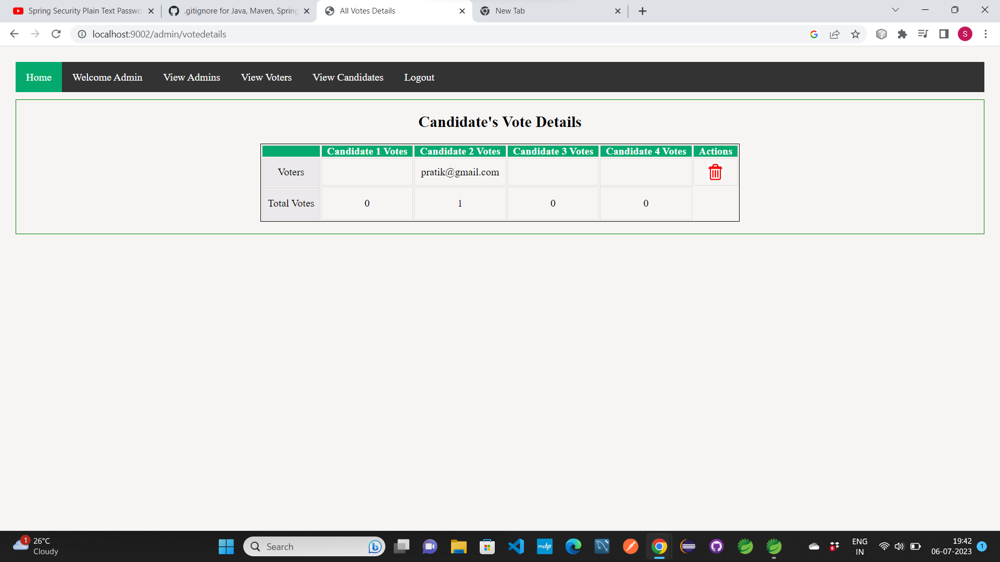

# VotingApp 

 ### Take a look at this Application
url: https://github.com/FlavienNgueukam/Java-Springboot-VotingApp-master/
 
### It is SpringBoot Project with Thymeleaf Frontend. Build in Spring Tool Suite.
## It is a Voting Application. 

### Application Features:
- User can vote the Candidate.
- Admin has the permission to see the vote details, manage Voters and Candidates votes.

### Technology used in this Project: 
- i) Thymeleaf,CSS : designing page layout. 
- ii) Java : all the logic has been written in java. 
- iii) MySQL: MySQL database has been used as database.
- iv) SpringSecurity: SpringSecurity has been used for authentication.
- v) Hibernate: Hibernate ORM is used.

### Software And Tools Required:
- Java JDK 8+ 
- Eclipse EE or Spring Tool Suite
- MySQL

### Steps To Import And Run The Project in Eclipse EE
- In Eclipse or Spring Tool Suite
- Click on File
- Select Import
- Select Projects from Git(with smart import) -> Next
- Select Clone URI -> Next
- In URI paste this url: https://github.com/FlavienNgueukam/Java-Springboot-VotingApp-master/
  -> Next
-  Now in Local Destination

-  proceed -> Next

            Now only select VotingApp\VotingApp
            -> Finish
   
-  If everything goes right Project will get successfully imported
-  Now wait for few seconds for getting things properly loaded

-  Now open Project > src/main/resources > open application.properties file,
   inside this file look for
   
   spring.datasource.url=jdbc:mysql://localhost:3306/springbootnew?serverTimezone=UTC

   here "springbootnew" is the name of the database.
   
     so

   ## create database name "springbootnew" in MySQL.

    or

   (you can also create the database with different name in MySQL. but the created database
   name in MySQL should match the database name in url in application.properties file.
   so according to created database in MySQL set the database name in url in 
   application.properties 
   file.
   - Now save the changes.)
  - And Try to Run the Project

  ### If you are using Spring Tool Suite 
 -  Right Click On Project > Run As > Spring Boot App 
 -  Now in Browser Type Url: http://localhost:9002
 -  Note: In Url put Port according to your application.properties file.
 -  Application will get Open
   
 ### If you are using Eclipse EE
 - Open Project > open application.properties file >
 
  Now do some changes, Change port number according to your Tomcat Server
  and save the file. 
  
 - Right Click On Project > Run as > Spring Boot App
 - Now in Browser Type Url: http://localhost:9002
 -  Note: In Url put Port according to your application.properties file.
 -  Application will get Open.

### Some Screenshots of this Project:

==================================================================================================================================================================

==================================================================================================================================================================

==================================================================================================================================================================

==================================================================================================================================================================

==================================================================================================================================================================

==================================================================================================================================================================

==================================================================================================================================================================

### Project Creator: Flavien Ngueukam

